<div align="center">

# 🧬 DEG Pipeline & Visualizer

### All-in-one desktop GUI for end-to-end RNA-seq Differential Gene Expression (DEG) analysis & publication-ready visualization — powered by PyDESeq2

<em>No coding required. Load your counts, run the statistics, export the figures.</em>

<br/>

[](https://www.python.org/)
[](https://opensource.org/licenses/MIT)
[](#)
[](https://pydeseq2.readthedocs.io/)
[](#-installation)

<br/>

[](https://github.com/alirezabk1382927-sys/DEG-Pipeline-Visualizer/stargazers)
[](https://github.com/alirezabk1382927-sys/DEG-Pipeline-Visualizer/network/members)
[](https://github.com/alirezabk1382927-sys/DEG-Pipeline-Visualizer/issues)

<br/>

<a href="#-installation"><b>Installation</b></a> •
<a href="#-step-1--differential-expression-analysis"><b>Analysis Engine</b></a> •
<a href="#-step-2--visualization-engine"><b>Visualization</b></a> •
<a href="#-screenshots--example-output-figures"><b>Gallery</b></a> •
<a href="#-citation"><b>Citation</b></a>

</div>

<br/>

---

## 📖 Overview

RNA-sequencing has become the cornerstone of modern transcriptomics, enabling researchers to uncover the molecular drivers of cancer, drug resistance, and metastasis. Yet, turning thousands of raw count files into interpretable, statistically robust results remains a steep challenge:

| Challenge | Why it hurts |
|:--|:--|
| 🧮 **Statistical modelling** | Running DESeq2 properly requires proficiency in R or Python |
| 🗂️ **Data wrangling** | Merging sample sheets, handling duplicates, filtering low-count genes is tedious and error-prone |
| 🎨 **Figure generation** | Publication-quality plots with custom gene labels demand manual coding and endless tweaking |
| 🔁 **Sharing workflows** | Environment conflicts arise across teams, especially packaging multiprocessing libraries into `.exe` files |

> **DEG Pipeline & Visualizer** solves all four — it performs the statistical analysis in one step, then lets you regenerate and customize any figure from the saved results, **without rerunning the analysis or writing any code.**

<br/>

## ✨ Features

<table>
<tr>
<td width="50%" valign="top">

### 🔬 Analysis
- **Automated DEG Engine** built on PyDESeq2, with robust filtering, dispersion estimation, and Wald testing
- **Full statistical output saved for reuse** — complete results, significant DEGs, and up-/down-regulated gene lists
- **Multiprocessing-safe architecture** — custom isolation prevents recursive worker deadlocks when freezing PyDESeq2 with PyInstaller
- **Clean data management** — automatic GDC sample sheet parsing, duplicate removal, structured CSV/TXT caching

</td>
<td width="50%" valign="top">

### 🎨 Visualization
- **Publication-ready plots** — Volcano, MA, expression heatmaps (Z-score or rank-based), summary bar charts
- **Intelligent gene labelling** — supply a target gene list; labels are placed automatically with collision-free connectors
- **Zero-coding standalone binary** — compiled Windows `.exe`, ready for shared lab environments
- **Multi-format export** — PNG, PDF, TIFF, SVG at custom resolutions and dimensions

</td>
</tr>
</table>

<br/>

## 🖼️ Screenshots — Example Output Figures

<div align="center">

| Volcano Plot (with gene labels) | MA Plot (with gene labels) |
|:---:|:---:|
| 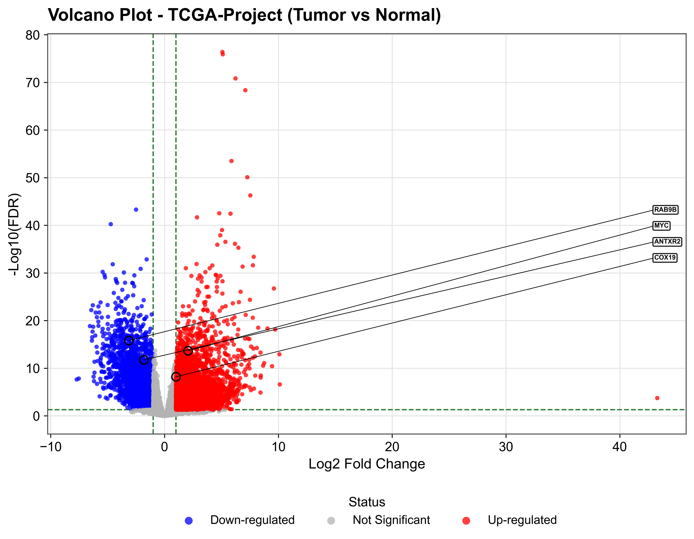 | 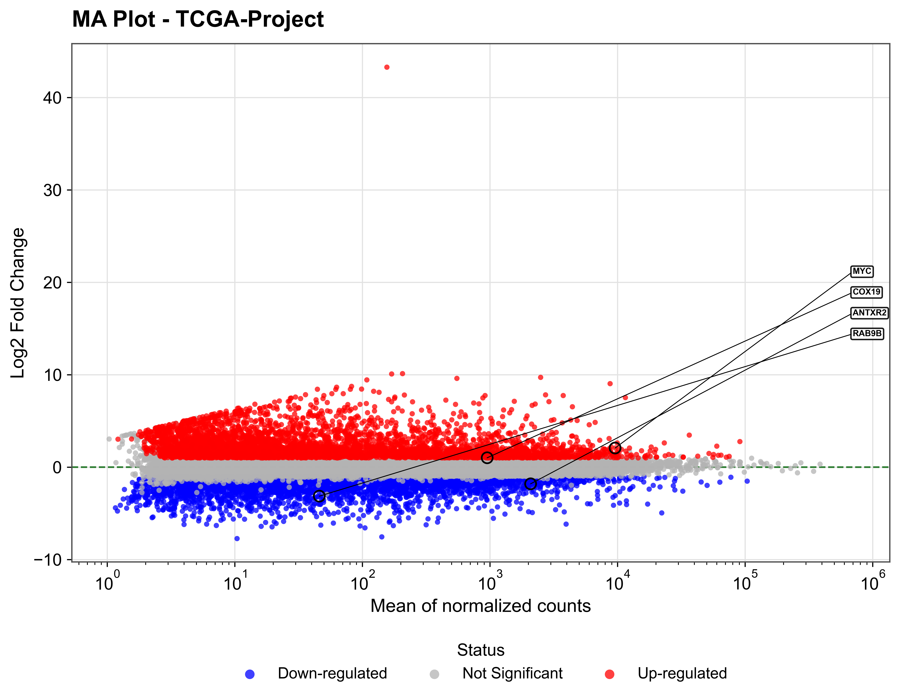 |

| Combined Standard Figures | Summary Bar Chart |
|:---:|:---:|
|  | 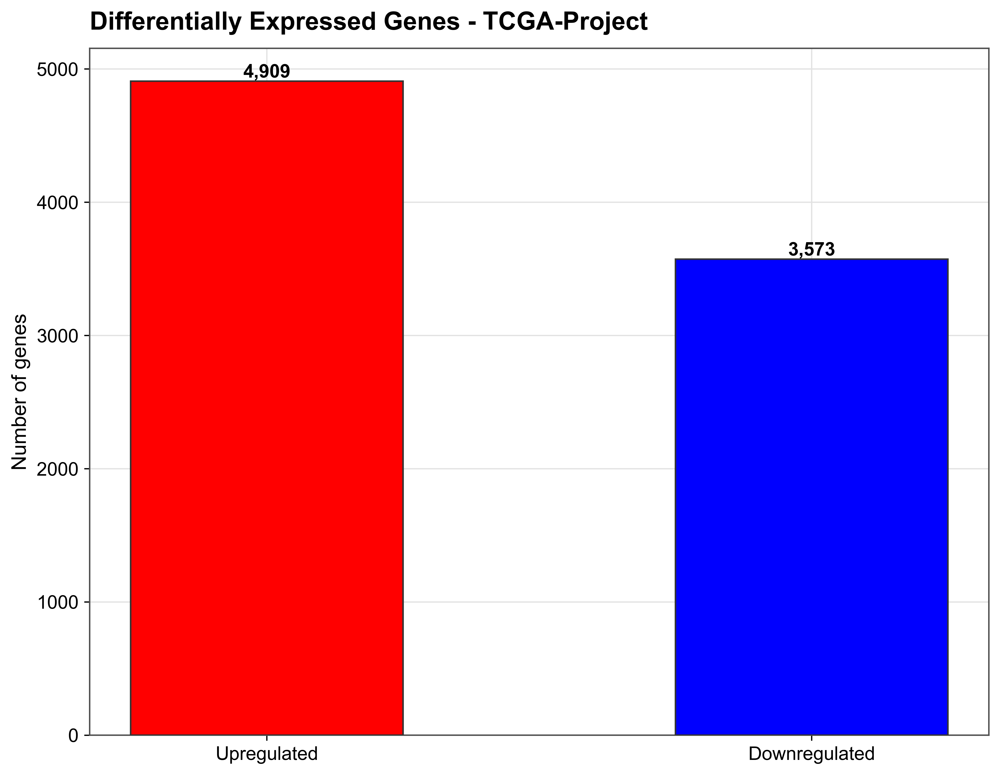 |

</div>

> 💡 **Tip:** Click any image to view it in full resolution. All figures shown here were exported directly from the application, using public TCGA data (Tumor vs. Normal).

<br/>

<details>
<summary><b>🖥️ Click to expand — Full UI Walkthrough (step-by-step)</b></summary>

<br/>

| Step 1: Launching the Application | Step 2: Main Tab |
|:---:|:---:|
| 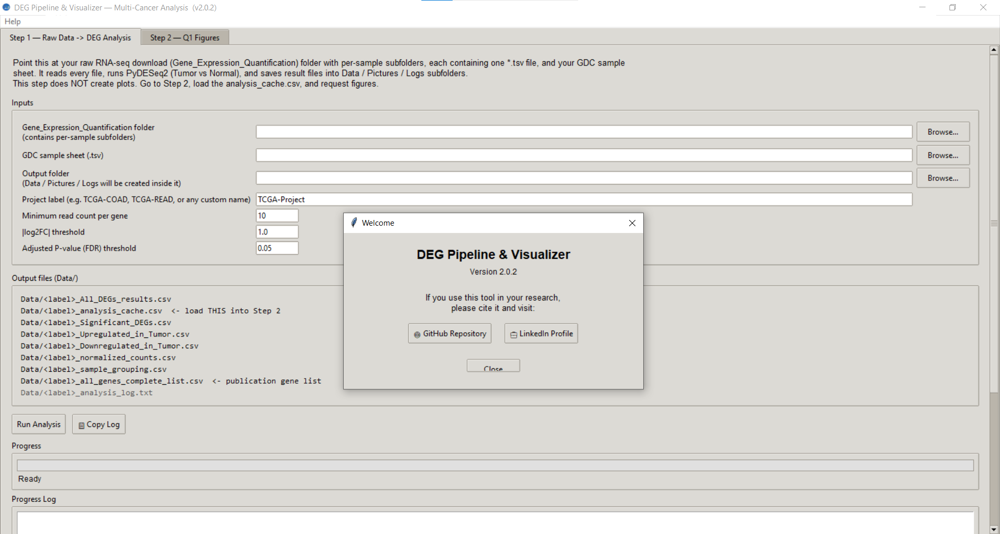 | 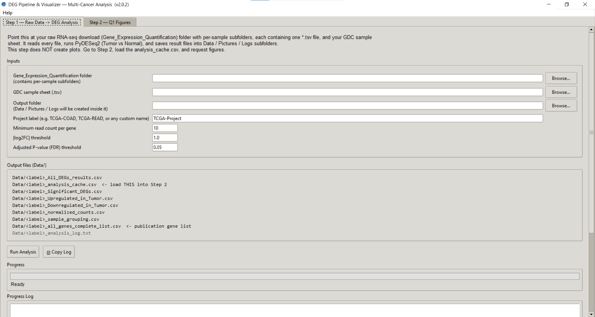 |

| Step 3: Second Tab | Step 4: Loading Data into Step 1 |
|:---:|:---:|
| 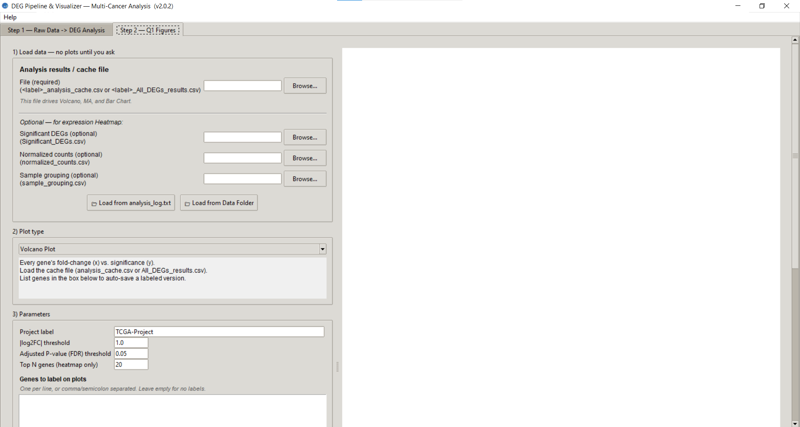 | 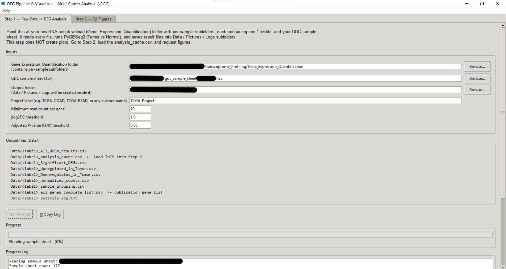 |

| Step 5: Running Analysis (In Progress) | Step 6: Step 1 Complete — Data Saved |
|:---:|:---:|
| 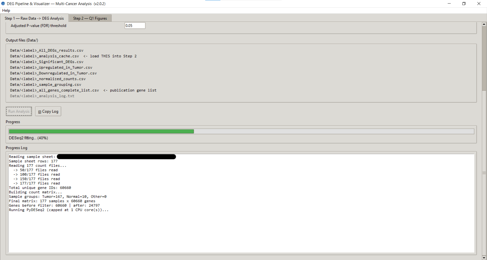 | 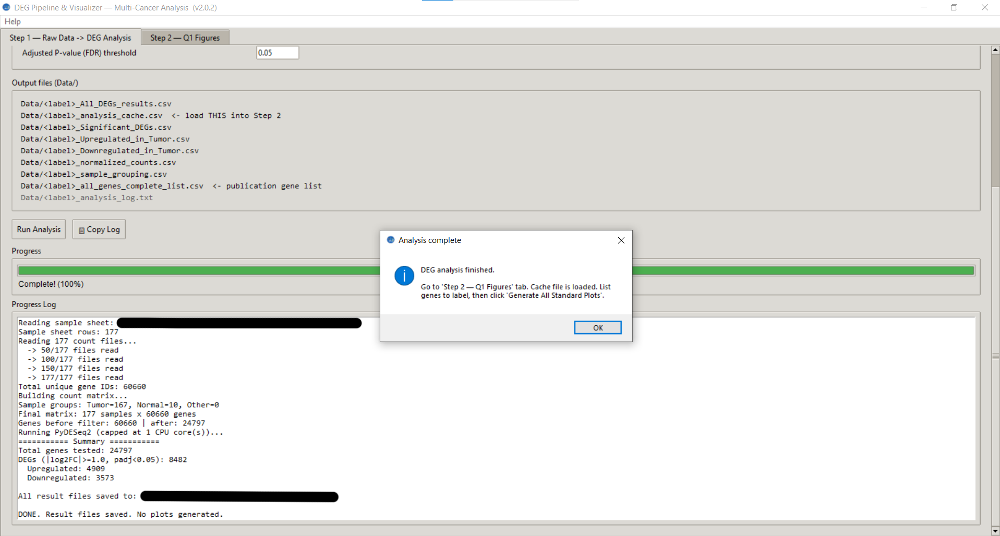 |

| Step 7: Auto-loaded Paths | Step 8: Gene Input & Export Settings |
|:---:|:---:|
| 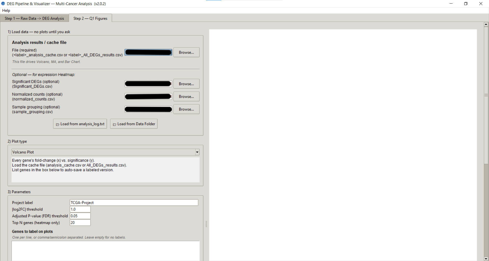 | 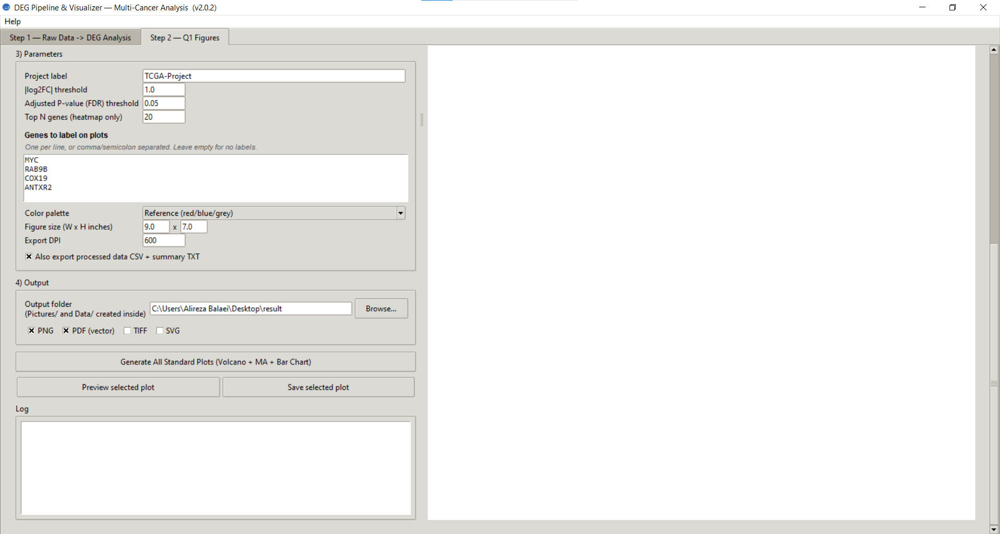 |

| Step 9: Step 2 Complete — Results Saved | Viewing Generated Plots |
|:---:|:---:|
| 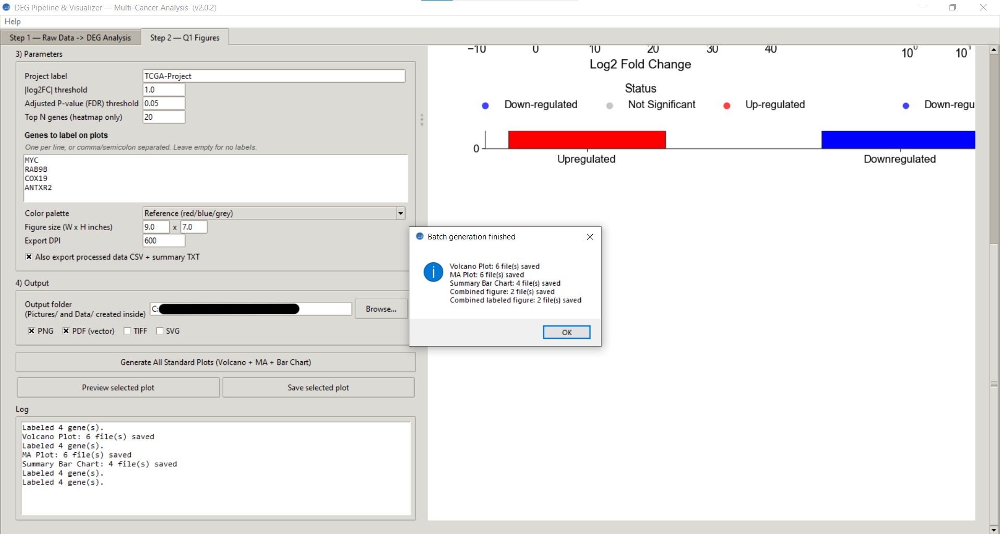 | 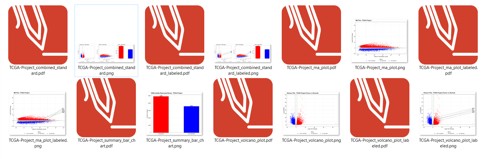 |

</details>

<br/>

## 🔄 Workflow

The pipeline is split into two clear, modular steps: **statistical analysis first, visualization second.**

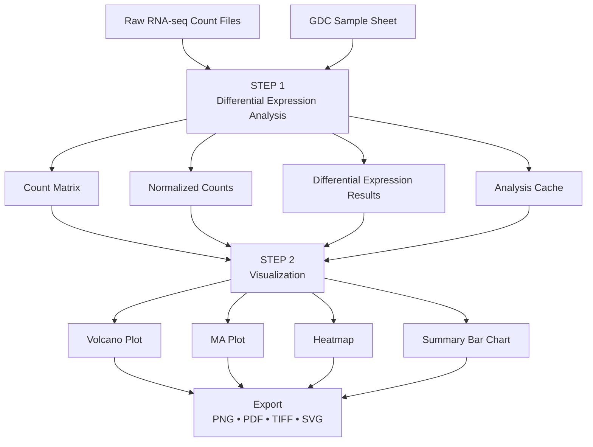
```mermaid
flowchart TD

    A[Raw RNA-seq Count Files]
    B[GDC Sample Sheet]

    A --> C
    B --> C

    C["STEP 1<br/>Differential Expression Analysis"]

    C --> D1[Count Matrix]
    C --> D2[Normalized Counts]
    C --> D3[Differential Expression Results]
    C --> D4[Analysis Cache]

    D1 --> E
    D2 --> E
    D3 --> E
    D4 --> E

    E["STEP 2<br/>Visualization"]

    E --> F[Volcano Plot]
    E --> G[MA Plot]
    E --> H[Heatmap]
    E --> I[Summary Bar Chart]

    F --> J["Export<br/>PNG • PDF • TIFF • SVG"]
    G --> J
    H --> J
    I --> J
```

<br/>

## 📊 Step 1 — Differential Expression Analysis

The first stage performs a complete RNA-seq differential expression workflow starting from raw GDC/TCGA count files — this is where the actual statistics happen. Everything after this step is visualization of these results.

**Main tasks**
- Reads and validates the GDC Sample Sheet
- Automatically synchronizes metadata with expression files
- Detects and removes duplicated samples
- Builds a unified gene count matrix
- Filters genes with extremely low expression
- Estimates size factors and normalizes read counts
- Estimates gene-wise and fitted dispersions using **PyDESeq2**
- Performs Wald statistical testing
- Adjusts p-values using the Benjamini–Hochberg FDR procedure
- Classifies every tested gene as upregulated, downregulated, or not significant
- Generates reusable cache files for downstream visualization

**Generated files**

| File | Description |
|:--|:--|
| `All_DEGs_results.csv` | Complete statistical results for every detected gene |
| `Significant_DEGs.csv` | Genes passing user-defined significance thresholds |
| `Upregulated_in_Tumor.csv` | Upregulated genes |
| `Downregulated_in_Tumor.csv` | Downregulated genes |
| `all_genes_complete_list.csv` | Every tested gene with fold-change, p-values, and regulation status (Up/Down/NS) |
| `normalized_counts.csv` | Normalized expression matrix |
| `sample_grouping.csv` | Parsed sample metadata |
| `analysis_cache.csv` | Optimized cache used by the visualization module |

<br/>

## 📈 Step 2 — Visualization Engine

The second stage transforms the statistical outputs generated in Step 1 into high-quality, publication-ready figures.

Unlike conventional workflows, **statistical analysis is executed only once**. Subsequent visualizations can be regenerated instantly by loading the cached analysis results — no need to rerun the DEG analysis just to change a plot's style or labels.

<table>
<tr>
<td valign="top">

**Available visualizations**
- Volcano Plot
- MA Plot
- Expression Heatmap
- Summary Bar Chart
- Combined multi-panel figure

</td>
<td valign="top">

**Interactive features**
- Custom log₂ Fold Change threshold
- Adjustable FDR threshold
- Dynamic DPI selection
- Flexible figure dimensions
- Automatic gene highlighting
- Collision-free label placement

</td>
<td valign="top">

**Export formats**
- 🖼️ PNG
- 📄 PDF
- 🎯 SVG (vector)
- 🎞️ TIFF

</td>
</tr>
</table>

<br/>

## 🚀 Installation

<table>
<tr>
<td width="50%" valign="top">

### Option 1 — Standalone Windows App ⭐ *Recommended*

For users who simply want to analyse RNA-seq datasets without installing Python.

1. Download the latest executable from the **[Releases](../../releases)** page
2. Extract the downloaded archive
3. Launch `DEG_Pipeline.exe`
4. Load your data and begin analysis immediately

No Python installation or command-line usage required. ✅

</td>
<td width="50%" valign="top">

### Option 2 — Run from Source

**Requirements:** Python ≥ 3.9, pip · Windows / Linux / macOS

```bash
# Clone the repository
git clone https://github.com/alirezabk1382927-sys/DEG-Pipeline-Visualizer.git
cd DEG-Pipeline-Visualizer

# Create a virtual environment
python -m venv venv

# Activate it
# Windows:
venv\Scripts\activate
# Linux / macOS:
source venv/bin/activate

# Install dependencies
pip install -r requirements.txt

# Launch the app
python deg_pipeline.py
```

</td>
</tr>
</table>

<br/>

## 📦 Core Dependencies

| Library | Purpose |
|:--|:--|
| `PyDESeq2` | Differential expression analysis |
| `pandas` | Data processing |
| `NumPy` | Numerical computation |
| `Matplotlib` | Scientific plotting |
| `Seaborn` | Statistical visualization |
| `adjustText` | Automatic gene-label optimization |
| `Tkinter` | Desktop graphical interface |

<br/>

## 📂 Input Data Structure

```text
Project_Directory/
│
├── Gene_Expression_Quantification/
│   ├── Sample_001/
│   ├── Sample_002/
│   └── ...
│
└── gdc_sample_sheet.tsv
```

<br/>

## 📁 Output Directory

```text
Output/
├── Data/
│   ├── All_DEGs_results.csv
│   ├── Significant_DEGs.csv
│   ├── Upregulated_in_Tumor.csv
│   ├── Downregulated_in_Tumor.csv
│   ├── all_genes_complete_list.csv
│   ├── normalized_counts.csv
│   ├── sample_grouping.csv
│   └── analysis_cache.csv
│
├── Pictures/
│   ├── Volcano Plot
│   ├── MA Plot
│   ├── Heatmap
│   ├── Summary Bar Chart
│   └── Combined Figure
│
└── Logs/
    └── analysis_log.txt
```

Each generated file is automatically organized into dedicated folders, making downstream analyses reproducible and easy to manage. ✅

<br/>

## 📚 Citation

If this software contributes to your published research, please cite the repository:

```bibtex
@software{Balaei2026,
  author  = {Alireza Balaei Kahnamoei},
  title   = {DEG Pipeline \& Visualizer},
  year    = {2026},
  url     = {https://github.com/alirezabk1382927-sys/DEG-Pipeline-Visualizer}
}
```

<br/>

## 📜 License

Released under the **[MIT License](LICENSE)**. You are free to use, modify, distribute, and incorporate this software into academic or commercial projects, provided that the original copyright notice and license are retained.

<br/>

## 👨‍💻 Author

<div align="center">

**Alireza Balaei Kahnamoei**

B.Sc. Biotechnology Student · Bioinformatics Researcher · Computational Biology Enthusiast · Python Developer

[](https://github.com/alirezabk1382927-sys)

</div>

<br/>

## 💬 Support

Questions, bug reports, feature requests, and scientific discussions are welcome.

- 🐛 Found a bug or have a feature request? [Open an issue](../../issues)
- 🤝 Interested in research collaboration? Reach out via GitHub or LinkedIn

<br/>

---

<div align="center">

### ⭐ If this project helps your research, consider giving it a star!

<em>Made with ❤️ for the bioinformatics research community.</em>

**Alireza Balaei Kahnamoei**

</div>
