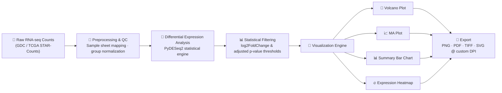
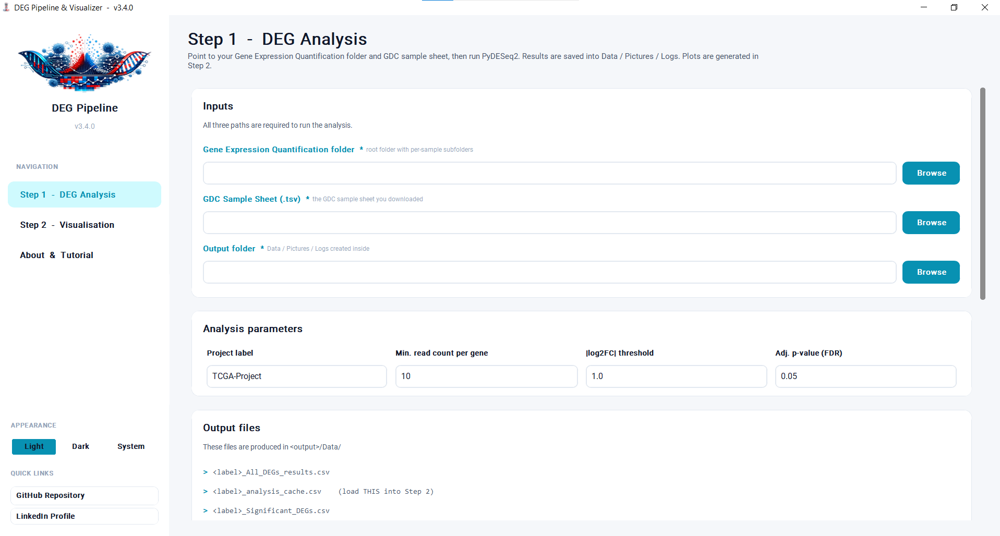
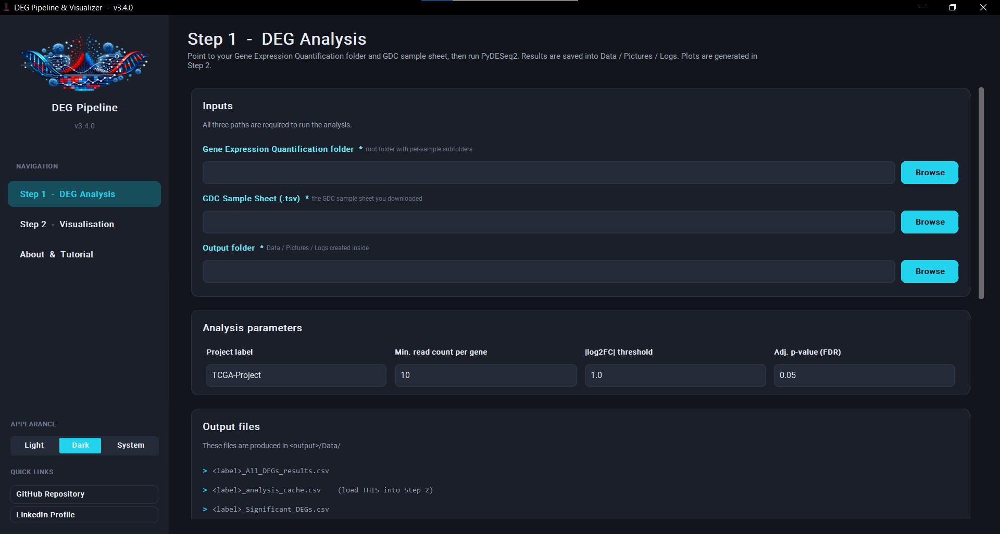

<div align="center">


# DEG Pipeline & Visualizer

### Multi-Cancer Differential Gene Expression Analysis & Publication-Ready Visualization Suite

**A modern desktop application for automated RNA-seq Differential Expression Analysis (DEA), powered by PyDESeq2, built for TCGA-style multi-cancer datasets.**

[](./LICENSE)
[](#-installation)
[](#-requirements)
[](https://github.com/scverse/PyDESeq2)
[](#)
[](#)

[Overview](#-overview) •
[Features](#-key-features) •
[Screenshots](#-screenshots) •
[Installation](#-installation) •
[Usage](#-usage-guide) •
[Requirements](#-requirements) •
[Citation](#-citation) •
[License](#-license) •
[Author](#-author--contact)

</div>

---

## 📖 Overview

**DEG Pipeline & Visualizer** is a cross-platform desktop application that automates the full workflow of **Differential Gene Expression (DEG) Analysis** for bulk RNA-seq data — from raw TCGA/GDC count files all the way to **publication-quality figures** — without writing a single line of code.

It is designed for **bioinformaticians, cancer researchers, molecular biologists, and graduate students** working with **TCGA (The Cancer Genome Atlas)** or any GDC-formatted STAR-Counts RNA-seq datasets across **multiple cancer types**, and who need fast, reproducible, statistically rigorous differential expression results with beautiful, ready-to-publish plots.

The application wraps the statistical rigor of **PyDESeq2** (a Python re-implementation of the widely used R/Bioconductor **DESeq2** method) inside a clean, modern, dark/light themed graphical interface — so you can go from raw counts to a finished **Volcano Plot**, **MA Plot**, **Summary Bar Chart**, or **Expression Heatmap** in minutes.

### How it works — Data → Analysis → Visualization


```mermaid
flowchart LR
    A["📂 Raw RNA-seq Counts\n(GDC / TCGA STAR-Counts)"] --> B["🧹 Preprocessing & QC\nSample sheet mapping · group normalization"]
    B --> C["🧬 Differential Expression Analysis\nPyDESeq2 statistical engine"]
    C --> D["📊 Statistical Filtering\nlog2FoldChange & adjusted p-value thresholds"]
    D --> E["🎨 Visualization Engine"]
    E --> F1["🌋 Volcano Plot"]
    E --> F2["📈 MA Plot"]
    E --> F3["📊 Summary Bar Chart"]
    E --> F4["🔥 Expression Heatmap"]
    F1 --> G["💾 Export\nPNG · PDF · TIFF · SVG @ custom DPI"]
    F2 --> G
    F3 --> G
    F4 --> G
```

In short: the pipeline **ingests raw counts → runs statistical differential expression analysis → applies significance filtering → feeds the results into the visualization engine → generates and exports publication-ready charts.**

---

## ✨ Key Features

- 🧬 **Automated DEG Pipeline** — Full PyDESeq2-based differential expression analysis directly from GDC/TCGA Gene Expression Quantification (STAR-Counts) folders and sample sheets.
- 🖥️ **Modern Cross-Platform GUI** — Clean, responsive interface built with CustomTkinter, featuring both **Dark** and **Light** themes.
- 🌋 **Multiple Publication-Ready Plot Types** — Volcano Plot, MA Plot, Summary Bar Chart, and Expression Heatmap, all styled for scientific publication.
- 🏷️ **Smart Gene Labeling** — Automatically label genes of interest on plots, with intelligent overlap-avoidance powered by `adjustText`.
- 🎚️ **Configurable Statistical Thresholds** — Fine-tune `|log2FoldChange|` and adjusted p-value (`padj`) cutoffs to match your study design.
- 🖼️ **Live Multi-Plot Preview** — Generate and flip through all plots before exporting, with instant thumbnails.
- 📤 **Flexible Batch Export** — Export figures as **PNG, PDF, TIFF, or SVG** at custom DPI, individually or as a combined side-by-side composite figure.
- ⚡ **Multi-Threaded Processing** — Long-running analyses run in background threads with a live progress log, keeping the UI responsive.
- 🩺 **Multi-Cancer Ready** — Not limited to a single cancer type; works with any GDC/TCGA project (TCGA-COAD, TCGA-BRCA, TCGA-LUAD, etc.).
- 📚 **Built-In Tutorial & Citation Tools** — A guided in-app walkthrough and a one-click citation generator for your publications.
- 🌐 **Fully Cross-Platform** — Native support for **Windows**, **macOS**, and **Linux**.

---

## 🖼️ Screenshots

<div align="center">

### Light Theme


### Dark Theme


</div>

> 💡 *Screenshot files live in the [`docs/`](./docs) folder as `light.png` and `dark.png`. Rename or replace them there if your exported filenames differ.*

---

## 📊 Sample Output Gallery

<div align="center">

| Volcano Plot | MA Plot |
|:---:|:---:|
|  |  |

| Summary Bar Chart | combined standard |
|:---:|:---:|
|  |  |

| ombined standard labeled |
|:---:|
|  |

</div>

---

## 💻 Installation

**DEG Pipeline & Visualizer** runs natively on **Windows**, **macOS**, and **Linux**. Choose the guide for your operating system below.

### ✅ Prerequisites (all platforms)

- **Python 3.10 or newer** — [Download Python](https://www.python.org/downloads/)
- **pip** (bundled with Python)
- **Git** (optional, for cloning the repository)

### 🪟 Windows

```powershell
# 1. Clone the repository (or download the ZIP from GitHub)
git clone https://github.com/alirezabk1382927-sys/DEG-Pipeline-Visualizer.git
cd DEG-Pipeline-Visualizer

# 2. (Recommended) Create a virtual environment
python -m venv venv
venv\Scripts\activate

# 3. Install dependencies
pip install -r requirements.txt

# 4. Run the application
python deg_pipeline.py
```

### 🍎 macOS

```bash
# 1. Clone the repository
git clone https://github.com/alirezabk1382927-sys/DEG-Pipeline-Visualizer.git
cd DEG-Pipeline-Visualizer

# 2. (Recommended) Create a virtual environment
python3 -m venv venv
source venv/bin/activate

# 3. Install dependencies
pip3 install -r requirements.txt

# 4. Run the application
python3 deg_pipeline.py
```

> On macOS, if `tkinter` is missing, install it via Homebrew: `brew install python-tk`

### 🐧 Linux

```bash
# 1. Install system-level Tkinter support (Debian/Ubuntu example)
sudo apt-get update && sudo apt-get install -y python3-tk

# 2. Clone the repository
git clone https://github.com/alirezabk1382927-sys/DEG-Pipeline-Visualizer.git
cd DEG-Pipeline-Visualizer

# 3. (Recommended) Create a virtual environment
python3 -m venv venv
source venv/bin/activate

# 4. Install dependencies
pip3 install -r requirements.txt

# 5. Run the application
python3 deg_pipeline.py
```

---

## 🚀 Usage Guide

1. **Prepare your data** — Download RNA-seq data from the **GDC Data Portal (TCGA)** as *Gene Expression Quantification — STAR-Counts*, along with the accompanying **GDC Sample Sheet (.tsv)**. Keep the original folder structure (one subfolder per sample).
2. **Run DEG Analysis** — Open the **Step 1 — DEG Analysis** tab, select the counts folder, the sample sheet, and an output folder. Set your project label and thresholds (`|log2FC| ≥ 1`, `padj < 0.05` are typical starting points), then click **Run DEG Analysis**.
3. **Load results into Visualization** — Results auto-load into **Step 2**, or load manually from the generated `Data/` folder.
4. **Choose a plot type** — Pick **All Plots** (Volcano + MA + Bar + Heatmap) or a single plot type.
5. **Label genes (optional)** — Paste gene symbols to highlight specific genes of interest on your plots.
6. **Preview & Export** — Generate live previews, then export all figures as PNG / PDF / TIFF / SVG at your chosen DPI.
7. **Cite the tool** — If this software supports your research, please cite it (see below) and ⭐ star the repository.

---

## 📦 Requirements

All Python dependencies are listed in [`requirements.txt`](./requirements.txt) and installed automatically via `pip install -r requirements.txt`. See that file for the exact, verified list of packages this application depends on.

---

## 📑 Citation

If **DEG Pipeline & Visualizer** contributed to your research, please cite it:

```
Balaei A. (2026). DEG Pipeline & Visualizer (v3.4.0) [Computer software].
https://github.com/alirezabk1382927-sys/DEG-Pipeline-Visualizer
```

Please also consider ⭐ **starring the repository** — it genuinely helps the project grow and supports continued development of free scientific software.

---

## 📜 License

This project is distributed under a **custom, restrictive, source-available proprietary license** — **NOT** MIT, Apache, GPL, or any other open-source license.

**The source code is visible for transparency and academic review only.** Copying, redistributing, modifying for redistribution, or commercially exploiting this software — in whole or in part — **without the Author's explicit written permission is strictly prohibited.**

See the full [`LICENSE`](./LICENSE) file for the complete terms.

---

## 👤 Author & Contact

**Developed and maintained by Alireza Balaei**

<div align="center">

| Platform | Link |
|:---|:---|
| 🐙 **GitHub** | [github.com/alirezabk1382927-sys](https://github.com/alirezabk1382927-sys) |
| 💼 **LinkedIn** | [linkedin.com/in/alireza-balaei-kahnamoei-aa8216344](https://www.linkedin.com/in/alireza-balaei-kahnamoei-aa8216344/) |
| 🔬 **ORCID** | [orcid.org/0009-0009-9746-6571](https://orcid.org/0009-0009-9746-6571) |
| 📦 **Repository** | [DEG-Pipeline-Visualizer](https://github.com/alirezabk1382927-sys/DEG-Pipeline-Visualizer) |

</div>

---

<div align="center">

*Built for the bioinformatics and cancer genomics community — RNA-seq analysis · TCGA · DESeq2 · differential gene expression · volcano plots · scientific visualization.*

**If this tool helped your research, please ⭐ star the repo and share it.**

</div>
